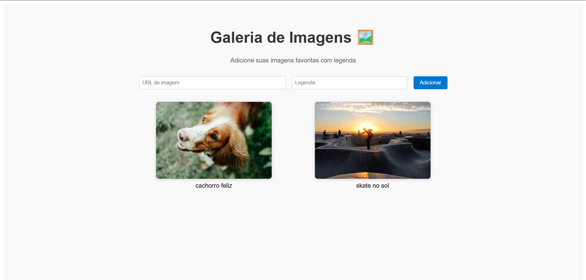

# 📸 Galeria de Imagens

Este é um projeto desenvolvido com **React + TypeScript + Vite** que permite ao usuário adicionar imagens com uma legenda personalizada. A aplicação utiliza os principais conceitos do React ensinados em aula: componentização, props, estado (`useState`) e eventos.

---

## 🚀 Tecnologias utilizadas

- [React](https://react.dev/)
- [TypeScript](https://www.typescriptlang.org/)
- [Vite](https://vitejs.dev/)

---

## 💡 Funcionalidades

- Adicionar imagens por meio de URL
- Atribuir uma legenda personalizada
- Visualizar as imagens em um layout responsivo de galeria
- Interface simples, limpa e moderna

---

## 🧠 Conceitos aplicados

- Componentização (`ImageCard`, `ImageGallery`)
- Estado com `useState`
- Eventos de formulário (`onChange`, `onClick`, `onSubmit`)
- Passagem de props tipadas
- Estilização inline com responsividade

---

## 📦 Como rodar o projeto

1. Clone este repositório ou extraia o `.zip`
2. Instale as dependências:
   ```bash
   npm install
   ```
3. Inicie o servidor de desenvolvimento:
   ```bash
   npm run dev
   ```
4. Acesse no navegador:
   ```
   http://localhost:5173
   ```

---

## 🖼️ Captura de tela



---

## 👨‍💻 Autor

**Gabriel**
Projeto desenvolvido como exercício prático da disciplina de Desenvolvimento Web com React + TypeScript.
